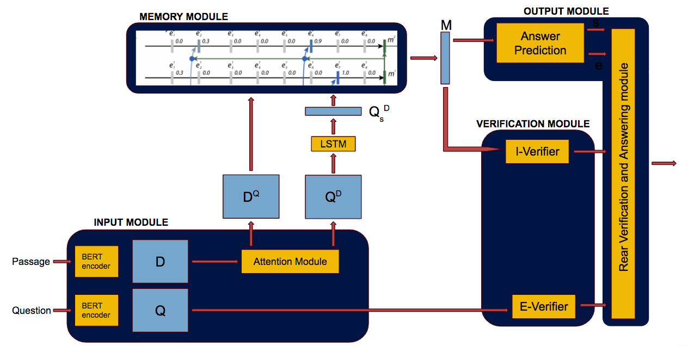

# retroqa
CIS 700 (Prof. Dan Roth) Final Project - Reasoning for Natural Language Understanding

This repo contains our code for the "Retrospective Reading and Dynamic Memory Networks for Question Answering" project.

Abstract: In recent years, memory networks have seen great success in the task of question answering (QA) over unstructured text. Our work builds on previous applications of memory networks in two major ways. First, we augment the state-of-the-art model on the SQuAD dataset with a Dynamic Memory Network (DMN+) module, which enhances the model with explicit reasoning capabilities. We also add a verification module in order to ensure the quality of the selected answer and to account for unanswerable questions. Evaluating on the [Microsoft NewsQA](https://www.microsoft.com/en-us/research/project/newsqa-dataset/) dataset, we observe how our changes affect the model's reasoning process.

Model architecture:

The dataset pre-processing code can be found [here](preprocessing.ipynb).

All the code we experimented with can be found [here](CIS_700_Final_Project.ipynb). Run all the cells marked with (R) in their title to reproduce results. The last section of the notebook contains the different experiments we performed.

To run our code we also created an easy to use script. Please run the run.py script to reproduce results. Before running the code, download the processed version of the [training](https://drive.google.com/file/d/1pE5ohlo0IVYw--Z8U3l_9xHhxV9fd23Z/view) and [validation](https://drive.google.com/file/d/1-58hzWASQ43hZrryRKl0WvQ4JnG-2pbM/view) sets and add them to the a folder within this repo.
